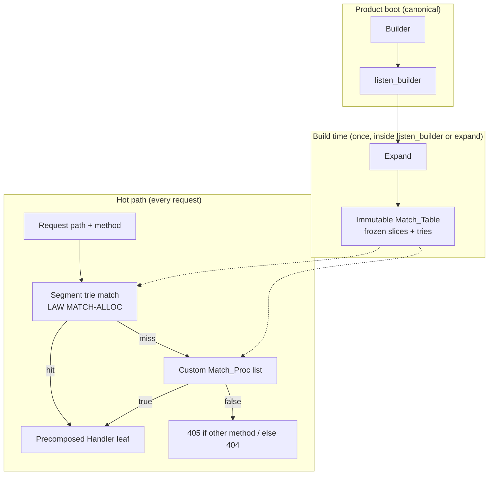
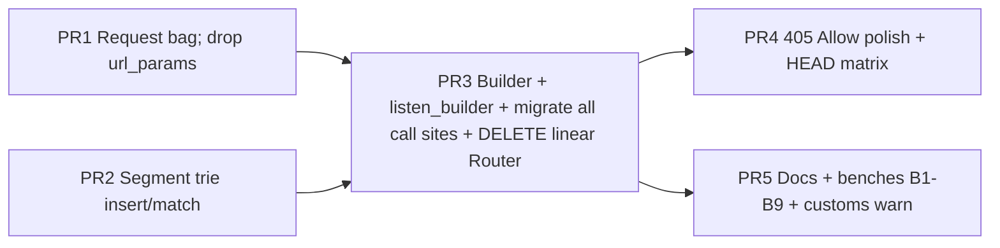

# proactr HTTP Builder façade + radix segment router + Match_Proc power escape

| | |
|--|--|
| **Status** | Draft (R4 — single path; no dual router) |
| **Author** | Systems architecture (design track) |
| **Audience** | Senior engineers implementing app-author routing ergonomics |
| **Scope** | App bootstrap, route match engine, request-scoped params/context |
| **Out of scope** | Host/wire/TLS/H2 pipe, protocol `#if`, APP_CONTRACT changes |
| **Related contracts** | [`docs/APP_CONTRACT.md`](docs/APP_CONTRACT.md) (**frozen**), [`docs/MIDDLEWARE_CONTRACT.md`](docs/MIDDLEWARE_CONTRACT.md) |
| **Primary code today** | [`http/routing.odin`](http/routing.odin), [`http/handlers.odin`](http/handlers.odin), [`http/middleware/chain.odin`](http/middleware/chain.odin), [`http/request.odin`](http/request.odin) |
| **Examples (ceremony)** | [`examples/empty_ok/main.odin`](examples/empty_ok/main.odin), [`examples/https_demo/main.odin`](examples/https_demo/main.odin) |

---

## Overview

proactr’s public handler surface is frozen and correct (oneshot `body_*` + `respond` / long-lived Effects; same handler across clear/TLS/H2). What remains ceremonial and hostile is **route assembly and path matching**:

- Linear `map[Method][dynamic]Route` with Lua-pattern strings (`core:text/match` / `match.find_aux`).
- Positional captures on `Request.url_params: []string`.
- Manual `router_init` → `route_get`… → optional `middleware.Chain` → `listen_and_serve(..., router_handler(&router), ...)`.

This design replaces that with three cooperating pieces:

1. **Builder façade** — composable tree of routes/groups/mounts with scoped middleware. **Canonical boot is `listen_builder`** (expand + own table + listen). `builder_expand` is power/advanced (tests, libraries, custom ownership).
2. **Segment trie** (one edge per path segment; no path compression in v1) — product patterns only: static, `{id}`, `{*path}`. **No regex route dialect.** Marketed as “radix” in the chi/httprouter sense (priority segment tree), not character-compressed patricia.
3. **Match_Proc power escape** — classify only (`proc(req) -> bool`); may write the **request context bag**; never responds; never writes `Path_Params` (radix-only).

**Hot path law:** builders **expand at build time** into a single immutable match structure (per-method segment tries + ordered custom matchers). That structure is **read-only and shared across workers**. Scoped middleware is **pre-wrapped** onto each leaf handler during expand.



---

## Background & Motivation

### What exists today

**Router** ([`http/routing.odin`](http/routing.odin)):

```odin
Route :: struct {
	handler: Handler,
	pattern: string,   // stored as "^" + pattern + "$"
}
Router :: struct {
	allocator: runtime.Allocator,
	routes:    map[Method][dynamic]Route,
	all:       [dynamic]Route,   // method-agnostic fallback
}
```

- `route_get` / … wrap patterns with `^…$`, linear scan + `match.find_aux`, positional `url_params`.
- Wrong method → 404 (or `route_all`), not 405.
- Hit path allocates `make([]string, n-1, context.temp_allocator)` for captures.

**Handler** ([`http/handlers.odin`](http/handlers.odin)): `Handler` / `handler` / `from_fn` / `handler_call_next`.

**Middleware** ([`http/middleware/chain.odin`](http/middleware/chain.odin)): heap-stable `^Handler` onion; `chain_wrap` = outer-first (`layers[0]` outermost). Scoped per-group MW requires hand-nested chains.

**Request** ([`http/request.odin`](http/request.odin)): `url_params: []string` only; no named params, no context bag.

### Why change

| Pain | Consequence |
|------|-------------|
| Lua/regex patterns | Product footgun; not segment-router mental model |
| Linear scan + `find_aux` + temp captures | O(routes); alloc on hit |
| Positional params | Fragile; no names |
| No builder | No groups/mounts/scoped MW |
| Nested runtime matchers | Pay middleware decision every request; fights multi-worker immutability |

### Constraints (must not break)

- [`docs/APP_CONTRACT.md`](docs/APP_CONTRACT.md) **frozen**: oneshot / Effects; hangup `.Client_Gone`; same handler clear/TLS/H2; no resume; no third intent rail.
- [`docs/MIDDLEWARE_CONTRACT.md`](docs/MIDDLEWARE_CONTRACT.md): layers remain ordinary `Handler`s; no protocol `#if`.
- Host/wire/TLS out of scope. Match_Proc is **routing classification only**, not a second dispatch rail for sessions.

---

## Goals & Non-Goals

### Goals

1. **One product path only:** `builder_init` → routes → `listen_builder` (no author-facing `Match_Table` on day one; expand is power/tests only).
2. Composable Builder: groups (Odin-native), mounts, merge, scoped middleware.
3. Segment trie: static / `{name}` / `{*name}` only; named `param()`; fail-at-build conflicts with **structured** diagnostics.
4. **LAW MATCH-ALLOC:** 0 heap/temp on match core happy path and miss path for routing itself.
5. Match_Proc after method-trie miss; classify + **context bag** only.
6. Wrap-at-build MW; immutable multi-worker share.
7. 405 + `Allow` when appropriate (see order law with customs).
8. **Clean cut:** linear Lua `Router` / `route_*` / positional `url_params` are **deleted** when the new stack lands — no dual API, no soft-deprecation period, no “legacy mode.”

### Non-Goals

- Regex / `{id:[0-9]+}` product dialect.
- Host protocol work; APP_CONTRACT changes.
- Nested runtime group matchers as primary model.
- Typed extractors / fluent method chaining (language limits — see comparison).
- OpenAPI, DI, virtual-host first-class trie dimension.
- **Keeping two routers** “for migration.” In-tree call sites migrate in the same change set that deletes the old code.

---

## Proposed Design

### 1. Mental model

```text
Author writes:     Builder tree (mutable, setup thread only)
Expand produces:   Match_Table (immutable; frozen slices)
Canonical serve:   listen_builder owns expand + table lifetime + listen
Power path:        builder_expand → match_table_handler → listen_and_serve
Workers share:     same Match_Table (read-only); no mutex on match
```

### 2. Canonical product boot (`listen_builder`)

**This is the product face.** `builder_expand` remains for tests, library authors who return a `Match_Table`, and advanced ownership.

```odin
// Product hello-world (canonical) — target ceremony
b: http.Builder
http.builder_init(&b)
defer http.builder_destroy(&b)

http.builder_get_fn(&b, "/", proc(req: ^http.Request, res: ^http.Response) {
	http.respond_plain(res, "OK")
})
http.builder_get_fn(&b, "/health", proc(req: ^http.Request, res: ^http.Response) {
	http.respond_plain(res, "ok")
})

s: http.Server
http.server_shutdown_on_interrupt(&s)
err, build_err := http.listen_builder(&s, &b, endpoint, opts)
if build_err.kind != .None {
	fmt.eprintf("route build: %s\n", http.builder_error_format(build_err))
	// server did not start
	return
}
if err != .None {
	fmt.eprintf("server exited: %v\n", err)
}
```

**`listen_builder` error contract (frozen — one path only):**

```odin
// Returns two values always. On expand failure: no listen, err == .None (or neutral),
// build_err.kind != .None with full structured diag (caller formats via builder_error_format).
// On listen failure after successful expand: build_err.kind == .None, err is host proactr.Error.
// On clean return from serve loop: both neutral (.None).
listen_builder :: proc(
	s: ^Server,
	b: ^Builder,
	endpoint: net.Endpoint = Default_Endpoint,
	opts: Server_Opts = Default_Server_Opts,
) -> (err: proactr.Error, build_err: Builder_Error)

// Implementation:
//  1. table, build_err = builder_expand(b, …)
//  2. if build_err.kind != .None → return (.None, build_err)  // NO listen; NO log-only
//  3. store table on Server for process life
//  4. err = listen_and_serve(s, match_table_handler(&table), endpoint, opts)
//  5. return (err, Builder_Error{kind = .None})
// Destroy: server_shutdown path calls match_table_destroy after workers join.
```

Authors on the product path always get structured expand diagnostics **without log scraping**. Do not invent a third error union type.

**Ownership freeze (v1):** `listen_builder` expands and **Server owns** the `Match_Table` until close. Power users call `builder_expand` themselves and pass `match_table_handler`; they own destroy after stop.

**Sugar (same PR as expand; used in product face above):**

```odin
builder_get_fn :: proc(b: ^Builder, path: string, f: Handle_Proc) // wraps handler() internally
// Same for post_fn / put_fn / … as needed; v1 requires at least get_fn.
```

### 3. Builder tree

```text
Builder
├── use(layers...) / use_fn(f)
├── group_begin(prefix) → ^Builder   // PRIMARY (Odin-native)
├── group_end()                      // optional pop; or child is mount-owned
├── mount(prefix, child: ^Builder)
├── merge(other: ^Builder)
├── get/post/.../route(methods, path, h)
├── match(match_proc, h)
└── not_found / method_not_allowed   // root-effective only after expand (see expand laws)
```

#### Odin-native groups (primary)

Do **not** rely on capturing `proc` callbacks as the only group API.

```odin
// Primary
api := http.builder_group_begin(&b, "/api")
http.builder_use(api, auth_layer(...))
http.builder_get(api, "/users/{id}", http.handler(get_user))
// api is a child Builder owned by b; no group_end required if begin registers child.
// Optional explicit end for stack-style APIs:
// http.builder_group_end(&b)

// Free-standing builder + mount (also first-class; best for library packages)
lib: http.Builder
http.builder_init(&lib)
// ... fill lib ...
http.builder_mount(&b, "/v1", &lib)

// Callback sugar ONLY (no captures — document Odin limit)
http.builder_group(&b, "/admin", proc(g: ^http.Builder) {
	http.builder_get(g, "/", http.handler(admin_home))
})
```

`builder_group_begin` returns `^Builder` pointing at a heap or arena child linked into parent’s `children`. Parent destroy frees children it owns; mounted external builders: document **borrow** (caller keeps alive through expand) vs **absorb** flag.

### 4. Layer attach — frozen packaging decision (**K15**)

**Decision: re-home a minimal `Layer` in package `http`.** Stock middleware adapts into it. `http` does **not** import `middleware`.

```odin
// package http — same shape as today's middleware.Layer
Layer :: struct {
	data:      rawptr,
	build:     proc(data: rawptr, next: ^Handler, allocator: runtime.Allocator) -> Handler,
	free_data: proc(data: rawptr, allocator: runtime.Allocator), // nil → free(data) only
}

builder_use :: proc(b: ^Builder, layers: ..Layer)
builder_use_fn :: proc(b: ^Builder, f: proc(req: ^Request, res: ^Response, next: ^Handler))
```

```odin
// package middleware — adapters (middleware already imports http)
request_id_layer :: proc(opts: Request_Id_Opts) -> http.Layer { ... }
// existing Layer in middleware becomes alias or thin wrapper:
// middleware.Layer may remain for Chain; chain_use continues; builders take http.Layer.
to_http_layer :: proc(l: Layer) -> http.Layer // middleware package adapts stock layers
```

**Layer order law (identical to `chain_wrap`):** `layers[0]` is **outermost**. Expand applies wrap in reverse registration order within a node’s accumulated stack (see Appendix A).

### 5. Expand semantics (complete)

```text
expand_node(node, prefix, stack_layers, table, diag) → Builder_Error:
  layers = concat(stack_layers, node.layers)   // ancestor outer … node outer-first

  // Visit order FROZEN (registration order within each list):
  //   1) routes
  //   2) customs
  //   3) children from group_begin (reg order)
  //   4) mounts (reg order)

  for route in node.routes:
    pattern = join_normalize(prefix, route.path)
    segs, err = parse_pattern(pattern) or return err
    leaf_h = wrap_layers(layers, route.handler, table)  // chain_wrap semantics
    for m in route.methods:
      insert(table.roots[m], segs, Route_Leaf{handler=leaf_h, pattern=intern(pattern)})
        or return conflict diag

  for custom in node.customs:
    leaf_h = wrap_layers(layers, custom.handler, table)
    // Store mount/group prefix on Custom_Entry — NO Match_Proc wrapping (Odin has no closures).
    gate = "" if prefix == "/" else prefix   // "" or "/" → no gate at match time
    append_custom_build(table, Custom_Entry{
      match   = custom.match,   // author proc unchanged
      handler = leaf_h,
      prefix  = intern(gate),   // joined mount/group prefix at this expand site
    })

  for child in node.children:
    expand_node(child, join(prefix, child.prefix), layers, table, diag)

  for mount in node.mounts:
    expand_node(mount.child, join(prefix, mount.prefix), layers, table, diag)

  // not_found / method_not_allowed: ONLY root Builder fields copied to Match_Table.
  // If a non-root node sets them → Builder_Error.kind = .Child_Status_Override (build error).
```

#### `merge` (frozen)

```text
builder_merge(b, other):
  Deep-copy into b (current prefix + b's layer stack at merge site):
    - routes (paths joined under b's current prefix)
    - customs (same; will get prefix gate at expand if under prefix)
    - children / mounts (as nested structure)
  Does NOT import other's root-level not_found / method_na.
  Does NOT prepend other's layers onto b's root; other's layers stay on
  the copied subtree nodes (as if those nodes were group_begin children).
  other may be destroyed only after merge returns (merge copies patterns/strings;
  Handler values copied by value — user_data still app-owned).
```

#### Mount × custom prefix gate (frozen — no closures, no “optional”)

**Mechanism (Odin-implementable):** expand stores the joined mount/group prefix on `Custom_Entry.prefix`. The **match loop** gates before calling `Match_Proc`. There is **no** `wrap_match_prefix` factory and **no** synthetic `Match_Proc` (cannot capture prefix with `proc(req) -> bool` alone).

```odin
Custom_Entry :: struct {
	match:   Match_Proc, // author-supplied; sees full path; classifies only
	handler: Handler,
	prefix:  string,     // interned; "" or "/" = no gate (top-level custom)
}
```

```text
// Segment-aware mount test (after both path and prefix trailing-slash-normalized).
// FORBIDDEN: raw strings.has_prefix(path, "/api") — that matches "/apiv2".
path_under_mount(path, prefix) -> bool:
  if prefix == "" or prefix == "/": return true   // should not be called for no-gate
  if path == prefix: return true
  if len(path) > len(prefix) &&
     path[:len(prefix)] == prefix &&
     path[len(prefix)] == '/':
    return true
  return false
```

Authors do **not** re-check mount prefix inside Match_Proc for mounted builders. Match_Proc still only receives `^Request` and classifies; it does not learn about the gate.

#### `not_found` / `method_not_allowed` (frozen)

- Only **root** Builder values become `Match_Table.not_found` / `method_na`.
- Child overrides → **build error** in v1 (no silent ignore). Libraries that need local 404 use a catch-all product route or custom under their mount.

### 6. Product pattern language (v1 — frozen)

| Form | Meaning |
|------|---------|
| static | exact segment |
| `{name}` | one segment |
| `{*name}` | catch-all remainder; **must be last** |

Laws: unique param names per pattern; no regex; no optional segments; catch-all final only; empty segments from pattern `//` → `Bad_Pattern`.

**Catch-all empty remainder: allowed.** `/files/{*path}` matches `/files` and `/files/` (after normalize) with `path=""`, and `/files/a/b` with `path="a/b"`.

**Author table (param values):**

| Pattern | Request path | `param` result |
|---------|--------------|----------------|
| `/users/{id}` | `/users/42` | `id="42"` |
| `/users/{id}` | `/users/42/` | `id="42"` (normalize) |
| `/files/{*path}` | `/files` | `path=""` |
| `/files/{*path}` | `/files/a/b` | `path="a/b"` |
| `/` | `/` | (no params) |

### 7. Trailing slash policy (**frozen**)

**Normalize-at-match: strip one trailing `/` except root `/`. No auto-redirect.**

- `/users` and `/users/` both match registered `/users`.
- Registering both `/users` and `/users/` → **build conflict** after normalize.
- Internal request `//` (empty segments): **no collapse**; walk misses (404 path) unless a pattern intentionally allows. Do not rewrite `//` → `/`.

Normalize implementation: **subslice / end-index only; never clone** (see LAW MATCH-ALLOC).

### 8. Segment trie layout (no path compression v1)

**Freeze:** one **path segment** per edge. Not character-compressed radix. Name in code: `Segment_Node` acceptable; docs may still say “radix” meaning priority segment tree.

```odin
Segment_Node :: struct {
	// Static edges: sorted parallel arrays; binary search (linear scan OK if fan-out ≤ 4 micro-opt later)
	static_keys: []string,       // frozen after expand; interned
	static_kids: []^Segment_Node,
	param:       ^Segment_Node,  // at most one
	param_name:  string,         // interned
	catch_all:   ^Segment_Node,  // at most one
	catch_name:  string,
	leaf:        Maybe(Route_Leaf), // terminal for this method tree
}
```

**v1 static edges:** sorted keys + kids only. **No hashmap on match.** No grow after expand.

### 9. Insert algorithm (normative)

```text
// No path compression. segs = full pattern segments after parse.
insert(node, segs, i, leaf) -> Builder_Error:
  if i == len(segs):
    if node.leaf is present:
      return Conflict{pattern_a: node.leaf.pattern, pattern_b: leaf.pattern, node_path: ...}
    node.leaf = leaf
    return None

  s = segs[i]
  switch s.kind:
    case Static:
      child = find_static(node, s.text)  // bsearch on static_keys
      if child == nil:
        child = new_node()
        sorted_insert_static(node, s.text, child)  // keeps keys sorted
      return insert(child, segs, i+1, leaf)

    case Param:
      if node.param != nil && node.param_name != s.text:
        return Conflict{...}  // dual param names at same node
      if node.param == nil:
        node.param = new_node()
        node.param_name = intern(s.text)
      return insert(node.param, segs, i+1, leaf)

    case Catch_All:
      if i != len(segs)-1:
        return Catch_All_Not_Final
      if node.catch_all != nil && node.catch_name != s.text:
        return Conflict{...}
      if node.catch_all == nil:
        node.catch_all = new_node()
        node.catch_name = intern(s.text)
      // Terminal leaf lives on the catch-all child node:
      return insert(node.catch_all, segs, i+1, leaf)  // i+1 == len → sets leaf on child
```

**Non-conflicts:** `GET /users/new` vs `GET /users/{id}` (static edge vs param edge).  
**Conflicts:** identical method+normalized pattern; dual param names; dual catch-all names; catch-all not final; duplicate names in one pattern; trailing-slash twins after normalize.

### 10. Match algorithm + priority + 405/customs order

#### LAW MATCH-ALLOC (normative)

```text
On radix/segment hit AND miss, match allocates 0 heap and 0 temp-arena
bytes for routing itself.
  - Walk path with byte indices only (start/end into req.url.path).
  - Static edge compare: path[i:j] vs interned key (memcmp/equal) — no make(string).
  - Param/catch-all values = slices of req.url.path (or normalized subslice of same buffer).
  - Path_Params / Request_Ctx live in Request; no make() in match core.
  - normalize_trailing_slash: end-index adjust only; never clone.
  - param() must not allocate; param_decoded may (opt-in).
  - route_pattern on hit (optional): interned pointer from leaf only; no clone.
  - Allow header materialization allocates only on confirmed 405 (request/temp arena).
```

#### Match clear law (**critical**)

```text
- Host / exchange boundary: req_ctx_reset + params.n = 0 at exchange start
  (and end if scrap reused). Same sites as other Request field resets (PR1 checklist).
- Match entry: clear **params only** (params.n = 0). Do NOT clear req.ctx.
  Outer middleware.Chain may have deposited ctx before match_table_handler runs.
- Match fills params on param/catch-all edges; never writes ctx.
- Match_Proc may write ctx only (not Path_Params).
```

#### Order law (frozen — customs before 405)

Preserves method-agnostic power via multi-method `builder_route` or Match_Proc (not a second router).

```text
1. method = request method as seen by handler entry
   (after host redirect_head_to_get rewrite if enabled — see HEAD freeze).
2. path = normalize_trailing_slash(req.url.path)  // subslice
3. params.n = 0
4. leaf = segment_walk(table.roots[method], path, &params)
   if leaf hit:
      optional req.route_pattern = leaf.pattern  // interned ptr
      run leaf.handler; return
5. // method trie miss:
   for e in table.customs:           // empty slice → zero iterations; free for static apps
     if e.prefix != "" && e.prefix != "/":
        if !path_under_mount(path, e.prefix): continue   // segment-aware; before Match_Proc
     if e.match(req):                // full path; no fake closure userdata
        run e.handler; return
6. // no custom:
   if path_exists_under_any_other_method(table, path):  // O(|Method| * depth)
      run method_na / default_405 with Allow
      return
7. run not_found / default_404
```

**Why customs before 405:** If `GET /hook` exists and a custom implements method-agnostic webhook on `/hook`, `POST /hook` must reach the custom. Product multi-method without customs: `builder_route(b, {.Get,.Post}, path, h)`. Document: keep customs rare; they are not a second router.

**405 probe:** walk every other method root with same normalize + priority walk. Param **names** may differ per method tree; Allow lists **methods only**. Cost ≤ `O(|Method| * depth)` with `|Method|` fixed (~9). **No heap until confirmed 405** then materialize `Allow` on temp/request arena.

#### `segment_walk` priority

At each remaining segment (index-based):

```text
1. static edge for this segment text → walk (no param write)
2. else param edge → write params[keys]=name, vals=path slice; walk
3. else catch-all edge → write remainder slice (may be empty); leaf on catch child
4. else miss
```

**Priority law: static > param > catch-all.**

#### HEAD / `redirect_head_to_get` (frozen)

| `Server_Opts.redirect_head_to_get` | Match sees | Required leaf |
|------------------------------------|------------|---------------|
| **true** (default today) | method rewritten to GET; `req.is_head` still true | GET leaf sufficient for HEAD |
| **false** | HEAD | explicit HEAD leaf; GET-only path → 405 Allow: GET |

### 11. Match_Proc power escape

```odin
// Classify only. May write Request ctx. Must NOT respond / body_* / sse_start / ws_start.
// Must NOT write Path_Params (use req_ctx_* only).
Match_Proc :: proc(req: ^Request) -> bool
```

- First custom returning true wins (runtime first-wins among customs — product routes still fail-at-build).
- Empty `customs` slice: miss path never calls a function pointer.
- Expand **debug log warning** when `C > CUSTOMS_WARN = 8`; hard doc: customs are power escape, not primary router.
- Match_Proc must not allocate unboundedly / run unbounded regex without author ownership (perf + security).

### 12. Request params + context bag (complete)

```odin
MAX_PATH_PARAMS :: 16
MAX_CTX_ENTRIES :: 16

Path_Params :: struct {
	n:    int,
	keys: [MAX_PATH_PARAMS]string,
	vals: [MAX_PATH_PARAMS]string, // views into path
}

Request_Ctx_Kind :: enum u8 { Ptr, String }

Request_Ctx_Entry :: struct {
	key:   string,
	kind:  Request_Ctx_Kind,
	ptr:   rawptr, // .Ptr
	str:   string, // .String — points at request-arena clone
}

Request_Ctx :: struct {
	n:       int,
	entries: [MAX_CTX_ENTRIES]Request_Ctx_Entry,
}

// Request fields (routing-related) — replace, do not dual-stack:
//   params: Path_Params        // named path captures only
//   ctx:    Request_Ctx        // middleware + Match_Proc bag
//   route_pattern: string      // optional; "" or interned template on hit
// DELETE: url_params []string  // no positional captures; no legacy field
```

**Helpers (concrete):**

```odin
param :: proc(req: ^Request, name: string) -> (string, bool) #optional_ok
param_decoded :: proc(req: ^Request, name: string, allocator := context.temp_allocator) -> (string, bool)
// NO param_set — Path_Params filled only by segment match.

req_ctx_set :: proc(req: ^Request, key: string, value: rawptr) -> bool
req_ctx_get :: proc(req: ^Request, key: string) -> (rawptr, bool)
req_ctx_set_string :: proc(req: ^Request, key, value: string) -> bool
  // clones value into request/temp allocator (exchange lifetime); stores kind=.String
req_ctx_get_string :: proc(req: ^Request, key: string) -> (string, bool)
req_ctx_reset :: proc(req: ^Request) // n=0 only; host exchange boundary

// Overflow policy (authors can test):
//   set_* return false when n == MAX_*; do not overwrite, do not heap-grow.
//   Debug builds: log.warning once per overflow.
//   Optional metric: request_ctx_overflow (if metrics exist).
//   Document MAX_CTX_ENTRIES = 16 in godoc.
```

**Middleware deposit convention (example):**

```odin
// Layer deposits after auth success, before next:
req_ctx_set_string(req, "user_id", uid) or_log_overflow
call_next(next, req, res)

// Handler:
uid, ok := req_ctx_get_string(req, "user_id")
```

Stock layers may use ctx bag or existing response hooks (`response_on_respond`); bag is for **request-scoped values visible to inner handlers**. Prefer bag over smuggling via globals.

**Default param encoding:** **raw path slices**. `param_decoded` opt-in only (matches `query_get` vs `query_get_percent_decoded` in [`http/routing.odin`](http/routing.odin)).

### 13. Structured build errors

```odin
Builder_Error_Kind :: enum {
	None,
	Conflict,
	Bad_Pattern,
	Catch_All_Not_Final,
	Duplicate_Param_Name,
	Empty_Path,
	Child_Status_Override, // child set not_found/method_na
	Customs_Warn,          // not returned as hard error; log only (kind reserved)
}

Builder_Error :: struct {
	kind:      Builder_Error_Kind,
	method:    Method,       // meaningful for Conflict; zero otherwise
	pattern_a: string,       // existing or bad pattern
	pattern_b: string,       // new pattern if Conflict
	node_path: string,       // trie location e.g. "/users/{id}"
	message:   string,       // one-line human; allocated on expand allocator
}

// ok when err.kind == .None
builder_expand :: proc(b: ^Builder, allocator := context.allocator) -> (table: Match_Table, err: Builder_Error)

builder_error_format :: proc(e: Builder_Error, allocator := context.allocator) -> string
// e.g. "conflict: GET /users/{id} vs GET /users/{user_id} at node /users"

// Product path: listen_builder returns (proactr.Error, Builder_Error) — see §2.
// build_err always populated on expand failure; no log-scrape, no third error type.
```

Ship with expand (PR3), not polish. Tests assert diag fields per conflict class.

### 14. Match_Table freeze + ownership

```odin
Match_Table :: struct {
	allocator:     runtime.Allocator,
	// After expand: NO [dynamic] on public hot fields — frozen slices only.
	roots:         [Method]^Segment_Node, // sparse nils OK
	customs:       []Custom_Entry,        // frozen; len 0 → free miss path
	not_found:     Handler,
	method_na:     Handler,
	handler_nodes: []^Handler,            // frozen; owns onion nodes
	layer_data:    []Tracked_Data,        // mirror Chain free rules
	// arena for interned strings + nodes
}

Custom_Entry :: struct {
	match:   Match_Proc,
	handler: Handler,
	prefix:  string, // interned mount/group gate; "" or "/" = none
}
```

| Object | Owner | Lifetime |
|--------|-------|----------|
| Nodes, interned strings, frozen slices | `Match_Table` | until `match_table_destroy` after workers stop |
| Precomposed `^Handler` onion nodes | table | same |
| Terminal handler `user_data` | **app** | app (never freed by table — mirror `chain_destroy`) |
| Layer opts `data` | table if tracked via Layer.free_data | same as Chain |
| `Builder` after expand | app may destroy | expand copied patterns; Handler values by value |
| Table under `listen_builder` | **Server** | until server close |

### 15. Expand cost (v1)

```text
Time  ~ O(R * S + E log F)
        R = routes, S = segments/route, E = static edges inserted,
        F = avg static fan-out (sorted insert)
Space ~ O(nodes + interned strings + precomposed Handler nodes + customs)
Forbidden:
  - any expand work deferred to first request
  - any global lock taken by match
  - publishing live [dynamic] as Match_Table hot fields
Customs list: O(C) append at expand; frozen to []Custom_Entry; warn if C > 8
```

---

## API / Interface Changes (implementable sketch)

```odin
package http

// --- Layer (re-homed; see K15) ---
Layer :: struct { data: rawptr, build: proc(...)->Handler, free_data: proc(...) }

// --- Builder ---
builder_init :: proc(b: ^Builder, allocator := context.allocator)
builder_destroy :: proc(b: ^Builder)

builder_use :: proc(b: ^Builder, layers: ..Layer)
builder_use_fn :: proc(b: ^Builder, f: proc(req: ^Request, res: ^Response, next: ^Handler))

builder_group_begin :: proc(b: ^Builder, prefix: string) -> ^Builder
builder_group :: proc(b: ^Builder, prefix: string, setup: proc(g: ^Builder)) // sugar; no captures
builder_mount :: proc(b: ^Builder, prefix: string, child: ^Builder)
builder_merge :: proc(b: ^Builder, other: ^Builder)

builder_get / post / put / patch / delete / head / options
builder_get_fn :: proc(b: ^Builder, path: string, f: Handle_Proc)
builder_route :: proc(b: ^Builder, methods: []Method, path: string, h: Handler)
builder_match :: proc(b: ^Builder, m: Match_Proc, h: Handler)
builder_not_found :: proc(b: ^Builder, h: Handler)
builder_method_not_allowed :: proc(b: ^Builder, h: Handler)

builder_expand :: proc(b: ^Builder, allocator := context.allocator) -> (Match_Table, Builder_Error)
builder_error_format :: proc(e: Builder_Error, allocator := context.allocator) -> string
match_table_destroy :: proc(t: ^Match_Table)
match_table_handler :: proc(t: ^Match_Table) -> Handler

// Canonical product entry — structured expand errors always returned (not log-only)
listen_builder :: proc(
	s: ^Server,
	b: ^Builder,
	endpoint: net.Endpoint = Default_Endpoint,
	opts: Server_Opts = Default_Server_Opts,
) -> (err: proactr.Error, build_err: Builder_Error)

// DELETED with this design (no dual path):
//   Router, router_init, router_destroy, router_handler,
//   route_get/post/…/route_all, routes_try, Lua pattern compile,
//   Request.url_params
```

---

## Compared to chi / axum / ntex (honest residual gaps)

| Capability | proactr (this design) | Peer | Residual gap |
|------------|----------------------|------|--------------|
| Segment params `{id}` | Yes + `param()` | chi / httprouter | **No typed extractors** (axum `Path<T>`) — strings only |
| Groups + scoped MW | Yes, wrap-at-build | chi `Route.With` | Per-route MW = one-route group (no `get_with` required in v1; optional sugar later) |
| Hello-world boot | `listen_builder` + `builder_get_fn` | chi `r.Get`+listen; axum `Router::serve` | No fluent chaining; still multi-statement (Odin), but no `handler()` tax on product face |
| Fluent builder | Proc-style `builder_get(&b,…)` | Rust/Go fluent | **No method chaining** (language) |
| Typed app state | rawptr / ctx bag strings | axum `State<T>` | **No typed state** — app holds globals or `user_data` |
| Method-agnostic route | `builder_route` all methods or Match_Proc | chi / ntex `route_all` class | Customs before 405; product multi-method via `builder_route` |
| Regex routes | **None** (Match_Proc only) | some frameworks | **Intentional product gap** |
| Host / vhost routing | Match_Proc | ntex guards | Not first-class |
| Dual API period | **None** — clean cut (K12) | — | In-tree call sites migrate when old `Router` is deleted |
| HEAD defaults | Host `redirect_head_to_get` | chi often auto | Sharper interaction — document matrix |

This design **does not claim** axum extractor ergonomics or Go fluent APIs. It claims: segment match, named params, scoped MW, fail-at-build, zero-alloc match core, collapsed boot via `listen_builder`.

---

## Data structures

Covered above: `Segment_Node`, `Route_Leaf`, `Match_Table` (frozen slices), `Path_Params`, `Request_Ctx`, `Builder_Error`, build arena.

**Route_Leaf:**

```odin
Route_Leaf :: struct {
	handler: Handler, // outermost precomposed value; next ptrs on heap nodes
	pattern: string,  // interned template for logs / optional req.route_pattern
}
```

---

## Conflict rules

Fail `builder_expand` / `listen_builder` when:

1. Identical method + normalized pattern.  
2. Dual param names at one node.  
3. Dual catch-all names at one node.  
4. Catch-all not final / bad braces / duplicate names in pattern / empty path.  
5. Trailing-slash twins after normalize.  
6. Non-root `not_found` / `method_not_allowed` set.

Non-conflicts: static vs param vs catch-all at same node (priority handles); different methods; customs (runtime order only).

---

## Cutover (no dual path)

**Law K12:** There is **one** routing stack. Soft deprecation, “legacy mode,” and dual `Router`+`Builder` are **forbidden**.

| Item | Policy |
|------|--------|
| Linear Lua `Router` / `route_*` / `router_handler` / `routes_try` | **Delete** in the same PR series that makes `listen_builder` the only public assembly path. Do not leave dead code behind “for later.” |
| `Request.url_params` | **Delete.** Named `param()` / `Path_Params` only. |
| `core:text/match` route use | **Gone** from package `http` product path. |
| Former `route_all` | `builder_route(b, all_methods, path, h)` or `builder_match` + Match_Proc — no second router. |
| Product examples + matrix servers | **Must** use Builder / `listen_builder` before or in the delete PR; tree must not compile against old symbols. |
| Perf claims | **Only** `Match_Table` exists — no “legacy baseline” product path. |
| Vendor laytan | Untouched baseline under `vendor/`; not linked by product `http`. |

### In-tree delete checklist (gate for merge)

When the cut lands, these (and any later hits) must already be migrated or removed:

- `examples/empty_ok`, `examples/https_demo`
- `comparisons/**` proactr servers that call `route_*`
- Any `http/*_test.odin` that builds a linear `Router`
- Docs that teach `router_init` as primary (`README`, middleware docs)

**Merge rule:** PR that introduces public Builder APIs **either** still has zero external callers of old APIs **or** is stacked with the delete PR so `main` never has two public routers.

Prefer **one vertical slice** for product surface: bag + trie + builder + migrate call sites + **delete** `routing.odin` linear types — split only if intermediate commits are private/stacked, not as a dual-API main.

---

## Alternatives Considered

| Alt | Trade-off | Decision |
|-----|-----------|----------|
| A. Builder + keep linear Lua dual path | Ceremony only; permanent cruft; two mental models | **Reject** — clean cut (K12) |
| B. Nested runtime group matchers | Familiar; per-request cost | Reject primary |
| C. `{id:[0-9]+}` in v1 | Validation at match; regex dialect | Defer; use handler/Match_Proc |
| D. Multi-method trie + bitsets | Better 405 single walk | Allowed equivalent if semantics identical; v1 may use per-method roots |
| E. Silent first-wins product routes | Simple insert | Reject |
| F. 405 before customs | Cleaner REST 405; kills method-agnostic customs / `route_all` class | **Reject** — customs before 405 (this design) |
| G. Expand as hello-world | Power-user purity | **Reject** — `listen_builder` canonical |

---

## Security

| Risk | Mitigation |
|------|------------|
| `{*path}` traversal | Match only slices; file I/O stays in static middleware jail |
| Param injection | Untrusted; no auto header reflection |
| Match_Proc abuse | No `res`; prefix-gated when mounted; after method miss only |
| ReDoS | No product regex; customs author-owned |
| Ctx rawptr lifetime | Must outlive request or live on request arena; document |

---

## Observability

- Structured `Builder_Error` + `builder_error_format` (author-facing).  
- Runtime miss: retain log style of today’s `router_handler` (operator choice; not on hit path).  
- Optional counters: radix hit / custom hit / 404 / 405 / ctx overflow.  
- No match-ns histogram on product hot path (benches only).

---

## Performance targets

### LAW MATCH-ALLOC

See §10 — normative zero heap/temp for routing core.

### Expand asymptotics

See §15.

### Customs hardness

- Empty list free (predictable branch).  
- Warn `C > 8` at expand.  
- After method-trie miss only.  
- Not a second router.

### Oneshot / static tax closure

| Tax | Law |
|-----|-----|
| Request POD bloat | Fixed `Path_Params`+`Request_Ctx`; reset is **`n=0` only** at exchange start, not full memset of keys |
| Match clear | **params only**; never ctx |
| 405 | ≤ O(\|Method\|×depth); heap only for Allow on confirmed 405 |
| `route_pattern` | Interned pointer only |
| Product benches | `Match_Table` only (only path that exists) |

### Microbench plan (normative — land with PR2+)

| ID | Topology | Methods | Op | Compare / acceptance |
|----|----------|---------|-----|----------------------|
| **B1** | 1 route `GET /` | GET | hit | empty_ok control; vs bare Handler; match overhead small constant |
| **B2** | 32 static GET, depth 1–3 | GET | hit first / hit last / miss | **beats** linear Lua `routes_try` at ≥32; growth ≈ O(depth) |
| **B3** | 256 static GET | GET | hit / miss | scale curve O(depth) not O(N) |
| **B4** | 64× `GET /users/{id}` + 16 static | GET | param hit | capture = fixed stores; **0 temp growth** (arena watermark) |
| **B5** | mixed depth-5, 128 leaves | GET | mid-tree hit | segment walk cost |
| **B6** | GET-only table; POST same path | POST | 405 after customs empty | multi-method probe; Allow alloc only on 405 |
| **B7** | 0 vs 8 customs; radix miss | GET | 404 | 0-customs ≈ pure miss; each custom additive |
| **B8** | `/files/{*path}` | GET | remainder + empty | catch-all slices |
| **B9** | multi-worker | GET | hit | shared table pointer; no per-worker copy; no races |

**Happy path (B1/B2 hit):** assert **0** temp-allocator growth attributable to match.

---

## Risks

| Risk | Mitigation |
|------|------------|
| Handler node lifetimes | Ownership table; destroy after workers join |
| HEAD/GET confusion | Frozen matrix + tests in expand PR |
| Customs overuse | Warn C>8; docs; examples lead with product patterns |
| Dual API / leftover Lua router | **K12 hard gate on PR3:** zero old symbols remain; CI greps `route_get`/`router_init` in product `http` + examples fail the cut |
| Import cycle | K15 Layer in `http` |
| Outer Chain ctx wipe | Match never clears ctx |

---

## Open Questions

**None blocking.** Resolved:

| # | Resolution |
|---|------------|
| 1 | **`listen_builder` canonical**; Server owns table. `builder_expand` power/advanced. |
| 2 | **Raw param views default**; `param_decoded` opt-in. |
| 3 | **`http.Layer` re-homed** in package `http`; middleware adapts; no `http`→`middleware` import. |

---

## References

| Artifact | Role |
|----------|------|
| [`http/routing.odin`](http/routing.odin) | Linear Lua baseline, temp captures |
| [`http/handlers.odin`](http/handlers.odin) | Handler composition |
| [`http/middleware/chain.odin`](http/middleware/chain.odin) | Onion + `chain_wrap` order precedent |
| [`http/request.odin`](http/request.odin) | Request surface |
| [`http/http.odin`](http/http.odin) | `Method` enum (~9) |
| [`http/server.odin`](http/server.odin) | `listen_and_serve`, `redirect_head_to_get` |
| [`docs/APP_CONTRACT.md`](docs/APP_CONTRACT.md) | Frozen app story |
| [`docs/MIDDLEWARE_CONTRACT.md`](docs/MIDDLEWARE_CONTRACT.md) | Middleware laws |
| [`examples/empty_ok/main.odin`](examples/empty_ok/main.odin) | Product sample to migrate |

---

## Key Decisions

| # | Decision |
|---|----------|
| **K1** | Product patterns only: static / `{name}` / `{*name}`. No regex product dialect. |
| **K2** | Match_Proc: `proc(req)->bool`; ctx writes only; **no** `Path_Params` writes; no respond/Effects. |
| **K3** | After **method trie miss**: customs (reg order) → else 405 if other-method path → else 404. |
| **K4** | Trailing slash: strip one `/` except root; no redirect; twins conflict at build. |
| **K5** | Expand → immutable `Match_Table` (frozen slices); multi-worker read-only share; no match mutex. |
| **K6** | Scoped MW = wrap-at-build; layer order = `chain_wrap` (`layers[0]` outermost). |
| **K7** | Fail build on product conflicts; structured `Builder_Error` + `builder_error_format`. |
| **K8** | Match priority: static > param > catch-all. |
| **K9** | 405 + Allow when path exists under other methods **and** no custom claimed the request. |
| **K10** | Named `param()`; raw views; `param_decoded` opt-in; ctx bag with string helpers; overflow → false. |
| **K11** | APP_CONTRACT frozen; Match_Proc not a third intent rail. |
| **K12** | **Single path:** delete linear Lua `Router` / `route_*` / `url_params` when Builder ships. No dual API, no soft deprecation period on `main`. |
| **K13** | Catch-all final; empty remainder OK; one param edge per node; **no path compression v1**. |
| **K14** | Expand visit: routes → customs → groups → mounts; DFS customs append order. |
| **K15** | **`http.Layer` in package `http`**; middleware adapts; builders never import middleware. |
| **K16** | **`listen_builder` is canonical product boot**; expand is power path. |
| **K17** | **LAW MATCH-ALLOC**: 0 heap/temp for match core; index walk; normalize = subslice. |
| **K18** | Match clears **params only**; ctx reset at exchange boundary only. |
| **K19** | Mount/group customs: expand stores `Custom_Entry.prefix`; match loop gates with segment-aware `path_under_mount` **before** calling Match_Proc (no wrapped Match_Proc / no closures). |
| **K20** | Root-only not_found/method_na; child override = build error. |
| **K21** | merge deep-copies routes/customs/children under current prefix; not root status handlers. |
| **K22** | HEAD: with `redirect_head_to_get` table sees GET; without, HEAD leaves only. |
| **K23** | Static edges: sorted arrays; no hashmap on match. |
| **K24** | Customs: empty free; warn C>8; power escape only. |
| **K25** | **`listen_builder` → `(proactr.Error, Builder_Error)`**; expand failures surface structured `build_err` to caller (no log-scrape-only). |
| **K26** | Product hello-world uses **`builder_get_fn`** (not bare `http.handler`). |

---

## PR Plan



| PR | Deliverable | Gates |
|----|-------------|-------|
| **PR1** | `Path_Params`, `Request_Ctx`, helpers; **remove `url_params`** from `Request` (update any internal users); host zeroes `params.n`/`ctx.n` at exchange start | No dual param fields on `Request` |
| **PR2** | Pattern parse; **insert** + **segment_walk**; conflicts; trailing slash; **LAW MATCH-ALLOC** tests; priority table | 0 temp on hit; O(depth) growth — benches vs a private pre-delete harness only, **not** a public dual router |
| **PR3** | **Single cutover** (one landable change set): Builder + expand + `http.Layer` + `listen_builder(err,build_err)` + `builder_get_fn` + mount prefix gate; **migrate every in-tree caller**; **delete** `Router` / `route_*` / `router_handler` / Lua match path (no old types left in `http`) | Tree builds with **zero** references to deleted symbols; examples + comparisons + tests green; cutover checklist done |
| **PR4** | Allow header polish; HEAD×redirect matrix if any gap | 405 only after customs; Allow alloc only on 405 |
| **PR5** | Docs (README, MIDDLEWARE); B1–B9 complete; customs C>8 warn; optional sugar | **No** migration box teaching old Router; product face only |

**Hard rule:** `main` must never ship **both** public `route_get` and `builder_get` as supported APIs. Intermediate work stays on a branch or stacked commits that land as one cutover.

**PR3 must not land without:** insert+expand laws (this doc), **K12 delete complete**, K15 Layer, structured errors, `listen_builder`, all in-tree call sites migrated.

---

## Test matrices (mandatory)

### Priority

| Patterns | Request | Winner |
|----------|---------|--------|
| `/users/new`, `/users/{id}` | `/users/new` | static |
| `/users/{id}`, `/users/{*rest}` | `/users/a` | param |
| `/files/{*path}` | `/files` | catch-all `""` |
| `/files/{*path}` | `/files/a/b` | catch-all `a/b` |

### 405 × custom

| Setup | Request | Result |
|-------|---------|--------|
| GET `/a` only, no customs | POST `/a` | 405 Allow: GET |
| GET `/a` + custom always-true | POST `/a` | **custom handler** (customs before 405) |
| GET `/a` + custom false | POST `/a` | 405 |
| no leaves, custom false | GET `/z` | 404 |

### HEAD

| Option | Leaves | Request HEAD `/x` | Result |
|--------|--------|-------------------|--------|
| redirect_head_to_get true | GET `/x` | HEAD | GET leaf; is_head true |
| false | GET `/x` only | HEAD | 405 Allow: GET |
| false | HEAD `/x` | HEAD | HEAD leaf |

### Conflicts (expand must fail + diag fields)

| Case | kind |
|------|------|
| Dual GET `/a` | Conflict |
| `{id}` vs `{user}` same node | Conflict |
| `/a` and `/a/` | Conflict |
| `{*p}` not final | Catch_All_Not_Final |
| Child not_found set | Child_Status_Override |

### Mount + layers

| Setup | Expect |
|-------|--------|
| root use logger; group `/api` use auth; GET `/api/x` | logger outermost, then auth, then handler (chain_wrap order) |
| mount `/v1` child with custom | custom runs for `/v1` and `/v1/…`; **not** for `/v1x` or `/v2` |
| mount `/api` custom always-true | `/apiv2` → gate miss → 404 (not custom) |

### Bag overflow

| Op | Expect |
|----|--------|
| 17th `req_ctx_set` | false; n stays 16 |
| Match does not clear ctx | outer deposit still visible |

---

## Appendix A — Wrap-at-build (= `chain_wrap`)

Identical to [`http/middleware/chain.odin`](http/middleware/chain.odin) `chain_wrap` semantics: **`layers[0]` outermost**.

```text
// layers[0] outermost
terminal = route.handler
cur = heap_copy(terminal)          // Match_Table tracks node; terminal user_data NOT freed
for i := len(layers) - 1; i >= 0; i -= 1:
  built = layers[i].build(layers[i].data, cur, alloc)
  n = heap_copy(built)
  n.next = cur
  cur = n
  track free_data for layers[i] if non-nil   // same as chain.layer_data
leaf.handler = cur^                // outermost Handler value; next ptrs heap-stable
```

## Appendix B — Default 404 / 405

Framework-owned unary `respond` (same class as today’s `router_handler`):

```odin
default_404: status Not_Found; respond
default_405: status Method_Not_Allowed; set Allow; respond
```

## Appendix C — Host touch checklist (PR1)

Not “zero host edits.” Document exact sites:

1. Clear H1 request init / connection loop request reset.  
2. H2 stream/slot request setup.  
3. Set `params.n = 0`, `ctx.n = 0` (and `route_pattern = ""`) at exchange start.  
4. Do **not** add match-time ctx clear in table handler.

---

## Revision log

**2026-08-10 — R4 (owner: no dual paths / no old cruft):**

- **K12 rewritten:** single routing stack; **delete** linear Lua `Router`, `route_*`, `router_handler`, `url_params` when Builder ships — **no** soft deprecation, **no** dual API on `main`.
- **Migration → Cutover:** in-tree checklist + merge rule (migrate + delete together).
- **Request:** only `Path_Params` + `Request_Ctx`; positional `url_params` removed from design.
- **PR plan:** PR3 is the cutover (Builder + migrate callers + delete old types); PR6 soft-deprec gone.
- Comparison table: dual-API period = none; regex = none (Match_Proc only).
- Alt A explicit reject of permanent dual path.

**2026-08-10 — R3 (ergo/quality residual blockers only; do not regress MATCH-ALLOC / customs-before-405):**

- **`listen_builder` error contract frozen:** `-> (err: proactr.Error, build_err: Builder_Error)`; expand failures return structured `build_err` to caller (format with `builder_error_format`); no log-scrape-only path; no third union type. §2 + API sketch + K25 aligned.
- **Product hello-world** uses **`builder_get_fn`** (K26); residual-gap table updated; PR5 face matches.
- **Mount custom gate implementable in Odin:** deleted `wrap_match_prefix` Match_Proc factory; **`Custom_Entry.prefix`** set at expand; match loop runs segment-aware **`path_under_mount`** before `e.match(req)`; forbids raw `has_prefix` `/api`→`/apiv2` bug. K19 rewritten.
- **Hygiene:** single error kind **`Child_Status_Override`**; Appendix A completed (full wrap loop + chain_wrap reference).
- Mount test matrix rows for `/v1` vs `/v1x` and `/api` vs `/apiv2`.

**2026-08-10 — R2 critic incorporation (ergo FAIL + perf/quality CONDITIONAL → fixes):**

- **Canonical boot:** `listen_builder` is product path; empty_ok / §boot rewritten; expand demoted to power/advanced; Server owns table under listen_builder.
- **Structured `Builder_Error`** + `builder_error_format` with method, patterns, node_path, message; ship with expand.
- **Context bag complete:** `req_ctx_set_string` / `get_string`; overflow → false + debug warn; middleware deposit example; Match_Proc **ctx-only** (no `param_set` / no Path_Params writes from customs).
- **Odin groups:** `builder_group_begin` primary; callback sugar secondary; mount first-class.
- **Layer packaging frozen (K15):** minimal `http.Layer` in `http`; middleware adapts; no http→middleware import.
- **Honest comparison** section vs chi / axum / ntex residual gaps.
- **LAW MATCH-ALLOC** + index walk; normalize = subslice; static edges sorted arrays only.
- **Microbench B1–B9** table with acceptance shape; expand asymptotics; customs empty-free + warn C>8.
- **Insert algorithm** normative; **no path compression v1**; segment tree naming clarified.
- **Expand holes frozen:** merge deep-copy rules; root-only not_found; mount customs **auto prefix-gated**; visit order routes→customs→groups→mounts; layer order = chain_wrap.
- **Match clear law:** params only; **never clear ctx** in match (outer Chain safe).
- **405 vs customs:** customs **before** 405 (method-agnostic / route_all class); `builder_route` for multi-method product.
- **HEAD freeze** with redirect_head_to_get matrix.
- **Ownership table** normative; Match_Table publishes frozen slices not live dynamics.
- **Test matrices** mandatory; PR plan reordered (`listen_builder`+errors in PR3; product face PR5).
- **Open questions closed** (listen_builder, raw params, Layer).
- Key Decisions extended K15–K24.
